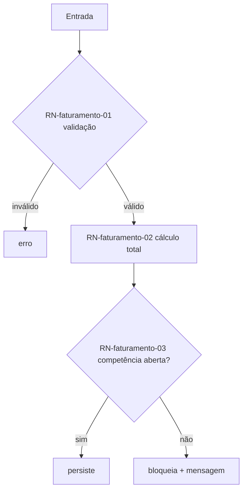
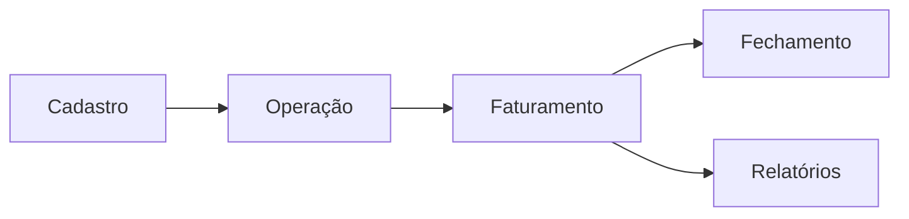

# Atlas de Fluxos de Regras de Negócio

<!--
  Visão AMPLA do negócio do legado: um índice navegável de TODAS as unidades (telas, endpoints, jobs,
  processamentos, relatórios) com o estado funcional de cada uma e o fluxograma das suas regras.
  Gerado/atualizado por /migracao-gerar-atlas-regras a partir dos ledgers memoria/regras-negocio/*.md.
  Vive em memoria/atlas-regras-negocio.md.

  Formato: doc + Mermaid (fonte da verdade). PROMOÇÃO FUTURA: vira uma página Vue navegável no app novo
  (análoga ao Styleguide), quando o Design System estiver pronto — ver seção "Promoção a página".

  NUNCA inventar fluxo: cada fluxograma é espelho do ledger da unidade; sem ledger, a unidade entra
  como "pendente de extração", não com fluxo fictício.
-->

## Para que serve
Dar ao dev a **visão ampla do funcionamento do negócio do legado** — como cada página/processo se comporta e como as peças se conectam — antes e durante a migração. É o mapa que responde "como esse sistema realmente funciona?".

## Como ler
Cada unidade tem: estado funcional, link para o ledger (fonte da verdade) e o fluxograma das suas regras. O índice ranqueia por criticidade e uso real.

---

## Painel — saúde do legado

| Métrica | Valor |
|---|---|
| Unidades mapeadas | {n} |
| ✔️ Funciona | {n} |
| ⚠️ Funciona com quirk | {n} |
| ❌ Quebrada | {n} |
| 💀 Código morto (a confirmar) | {n} |
| ⏳ Pendente de extração (sem ledger) | {n} |

---

## Índice de unidades

| Unidade | Tipo | Estado | Criticidade | Uso real | Regras | Ledger |
|---|---|---|---|---|---|---|
| Faturamento | 🖥️ tela | ⚠️ quirk | 🔴 Alta | 1.２k/mês | 12 | `regras-negocio/faturamento.md` |
| Fechar competência | ⚙️ job | ✔️ | 🔴 Alta | diário | 7 | `regras-negocio/fechar-competencia.md` |
| Export NF-e | 📄 relatório | ❌ quebrada | 🟡 Média | — | 4 | `regras-negocio/export-nfe.md` |

<!-- Ordenar por criticidade desc, depois uso real desc. Unidade sem ledger → linha com estado "⏳ pendente". -->

---

## Fluxos por unidade

<!-- Um bloco por unidade. O diagrama é COPIADO/SINCRONIZADO da seção "Fluxo das regras" do ledger. -->

### 🖥️ Faturamento — ⚠️ Funciona com quirk
> Ledger: `memoria/regras-negocio/faturamento.md` · Entrada: `/erp/faturamento.php`

**Quirks/avisos:** RN-faturamento-02 divide por 100 (🟠 a confirmar).

---

## Visão de negócio (macro)

<!-- Como as unidades se conectam: o fluxo de valor do legado (cadastro → operação → faturamento → fechamento). -->

---

## Promoção a página (app novo)
Quando o Design System (Gate 1) estiver pronto, este atlas vira uma **página Vue navegável** (`/atlas-regras` ou dentro da central técnica interna), consumindo os mesmos ledgers como fonte. Até lá, este doc é a fonte da verdade. Componentes previstos: índice filtrável por estado/tipo/criticidade, render de Mermaid por unidade, link para o ledger. Ver `docs/03-guardioes/guardiao-central-tecnica-interna.md`.
