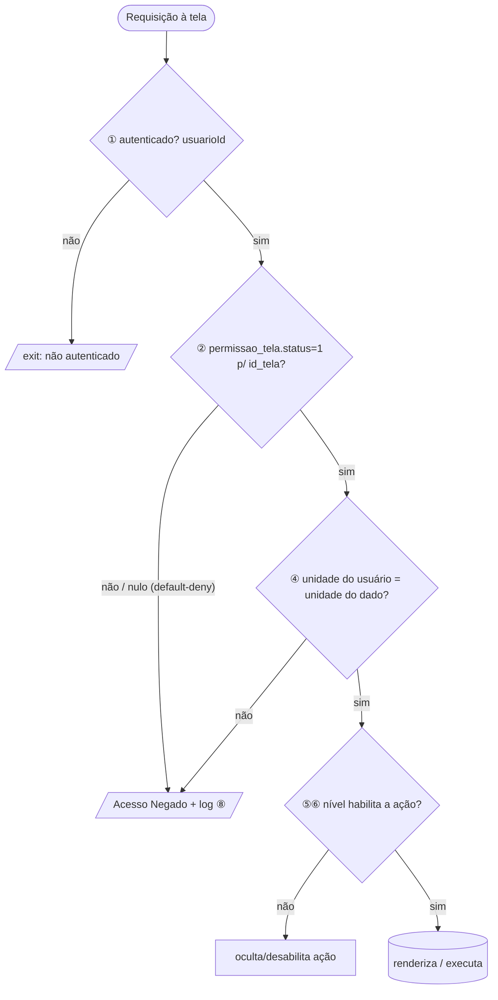

# Ledger de Permissões — {SLUG}

<!--
  Fonte da verdade do CONTROLE DE ACESSO desta tela/unidade legada.
  Gerado por /migracao-mapear-permissoes na Fase 05. Vive em memoria/permissoes/{slug}.md.
  Sobrevive ao fim da migração — consultável para sempre.

  REGRAS DE PREENCHIMENTO (ver docs/04-protocolos/protocolo-investigacao-permissoes.md):
  - Só se migra o acesso que se entende. Cada concessão/negação/escopo precisa de origem citada.
  - INVARIANTES: default-deny preservado · sem escalonamento · sem lockout.
  - Nunca inventar permissão nem presumir tela pública. Sem evidência → 🟡 Hipótese.
  - Qualquer MUDANÇA de acesso vs. legado = 🔴 → decisão do dev em memoria/decisoes.md.
-->

## Identificação

| Campo | Valor |
|---|---|
| Slug | {slug} |
| Tela / unidade | (nome) |
| ID no backlog | TELA-XXXX |
| **Realm de auth** | 🧑‍💼 usuário padrão (`$_SESSION['usuarioId']`) / 🩺 cirurgião / outro |
| Ponto de entrada legado | `URL legada` (citar) |
| `id_tela` (tabela `telas`) | (nº) — origem: `SELECT id_tela FROM telas WHERE url=…` |
| Rota nova equivalente | `modulo.recurso.acao` |
| `url_erp_laravel` (ponte) | preenchida? (sim/não) |
| **Guarda aplicada?** | ✅ inclui `verificar_permissao.php` (`arquivo:linha`) · 🟠 SEM guarda (pendência) |
| **Mapa verificado (apto Gate 2)** | ☐ Não · ✅ Sim (AAAA-MM-DD) |
| Última atualização | AAAA-MM-DD |
| Responsável | |

---

## Definição de Pronto (mapa "verificado")

<!-- A tela só passa pelo Gate 2 quando TODOS forem verdadeiros (ver protocolo). Lacuna investigável não bloqueia (o OML investiga e retoma); só 🟠/🔴 e lista-de-sujeitos-ao-vivo dependem do dev. -->

- [ ] **8 eixos** avaliados (cobertos ou "não se aplica" com evidência)
- [ ] **Guarda aplicada** confirmada (ou achado 🟠 registrado)
- [ ] **Default-deny** confirmado e preservado no novo
- [ ] **Escopos** setor/unidade/nível mapeados (multi-tenant sem vazamento)
- [ ] **Ações/CRUD** com condição de acesso citada
- [ ] **Mapeamento para o novo** (middleware/policy/gate/usePermissions + chave estável)
- [ ] **Veredito de paridade** preenchido; divergências 🔴 em `decisoes.md`
- [ ] Sem 🟡 Hipótese investigável pendente

---

## Legenda

**Eixos de acesso:** ① auth · ② tela · ③ setor · ④ unidade · ⑤ nível · ⑥ ação/CRUD · ⑦ domínio · ⑧ auditoria.

**Status do fato de acesso:**
- ✅ **Confirmado** — observado no código/banco com origem citada e/ou validado pelo dev
- 🟡 **Hipótese** — inferido, ainda não validado
- 🟠 **Aberto/anômalo** — tela sem guarda, permissão órfã, concessão inconsistente → **perguntar ao dev** (não consertar, não presumir seguro)
- 🔴 **Mudança de acesso** — afrouxar/apertar/ampliar/remover vs. legado → **decisão do dev** (`decisoes.md`)

**Veredito de paridade (por eixo):** ✓ preserva · ⬆️ escalona (proibido s/ decisão) · ⬇️ lockout (proibido s/ decisão) · 🔴 diverge intencional (decisão registrada).

---

## Matriz de acesso (núcleo do ledger)

<!-- Uma linha por (recurso × ação). Recurso = a tela e suas ações. Sujeito = quem pode (perfil/nível/setor/usuário). -->

| Eixo | Recurso / Ação | Sujeito que pode (legado) | Escopo (setor/unidade/nível) | Default-deny? | Origem (arquivo:linha / tabela / SQL) | Status |
|---|---|---|---|---|---|---|
| ② | abrir a tela | quem tem `permissao_tela.status=1` p/ `id_tela=NN` | — | ✅ sim | `verificar_permissao.php:32` · `permissao_tela` | ✅ |
| ⑥ | botão "Excluir" | nível ≥ admin | — | — | `tela.php:120` | 🟡 |
| ④ | dados exibidos | usuários da unidade | unidade = `$_SESSION['unidade']` | — | `tela.php:45` · `permissao_unidade` | ✅ |
| ⑦ | exportar estoque | quem tem `permissao_estoque` | — | — | `tela.php:200` | 🟡 |

---

## Mapeamento legado → novo (aplicação)

<!-- Para cada eixo: o mecanismo Laravel/Vue equivalente e a CHAVE estável. É o contrato de implementação e a base da paridade. -->

| Eixo | Legado (mecanismo + origem) | Novo (middleware / policy / gate / usePermissions) | Chave de permissão | Paridade |
|---|---|---|---|---|
| ① auth | `$_SESSION['usuarioId']` | `auth` middleware | — | ✓ |
| ② tela | `permissao_tela` + `telas` (default-deny) | route `can:ver,tela` + Policy | `tela.{slug}.ver` | ✓ |
| ③ setor | `permissao_setorv2` | scope de query + gate | `setor.{id}` | ✓ |
| ④ unidade | `$_SESSION['unidade']` + `permissao_unidade` | global scope por unidade | `unidade.{id}` | ✓ |
| ⑤ nível | `nivel_acesso` | gate por nível | `nivel.{n}` | ✓ |
| ⑥ ação | botão condicionado | `can:` + `usePermissions` (some/desabilita) | `tela.{slug}.{acao}` | ✓ |
| ⑦ domínio | `permissao_estoque` … | feature flag / gate | `dominio.{flag}` | ✓ |
| ⑧ auditoria | `view_unauthorized_logs.php` | log + `flash.error` (nunca 404) | — | ✓ |

---

## Sujeitos / concessões (quem tem) — origem citada

<!-- Lista de quem detém cada concessão. SQL no admin erp/ti/permissoes.php / permissao_usuario.php, ou query nas tabelas. Se não for possível ao vivo, marcar 🟡 e abrir pendência — NUNCA inventar a lista de usuários. -->

| Concessão | Sujeitos (perfis/setores/usuários) | Origem | Status |
|---|---|---|---|
| `permissao_tela id_tela=NN status=1` | (lista ou perfil) | `SELECT … FROM permissao_tela WHERE id_tela=NN` | 🟡 (validar ao vivo) |

---

## Dados sensíveis / LGPD (cruzar com guardiao-lgpd-privacidade.md)

<!-- A tela expõe dado pessoal/sensível (paciente/colaborador/saúde/financeiro)? O controle de acesso protege adequadamente? -->

| Dado exibido | Sensibilidade | Protegido por (eixo) | Obs |
|---|---|---|---|
| ex.: nome do paciente | pessoal/saúde | ② tela + ④ unidade | — |

---

## Diagrama — decisão de acesso (Mermaid)

---

## Achados e mudanças (registro destacado)

<!-- 🟠 (telas sem guarda, permissão órfã) e 🔴 (mudança de acesso) reunidos para visibilidade. Cada um com destino. -->

| ID | Achado / mudança | 🟠/🔴 | Encaminhamento |
|---|---|---|---|
| AC-{slug}-01 | ex.: tela não dá include na guarda | 🟠 | Perguntar ao dev (`pendencias.md`) |
| AC-{slug}-02 | ex.: novo exige login onde legado era aberto | 🔴 | Decisão do dev (`decisoes.md`) |
