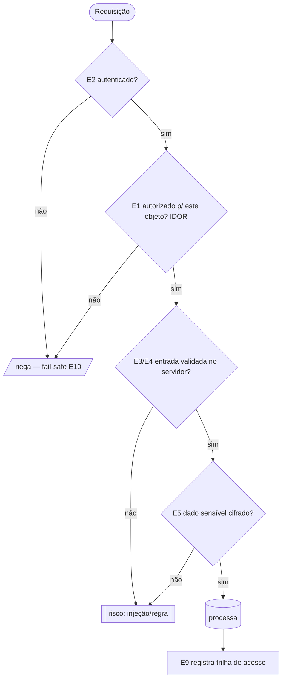

# Ledger de Segurança — {SLUG}

<!--
  Fonte da verdade da POSTURA DE SEGURANÇA desta tela/endpoint.
  Gerado por /migracao-mapear-seguranca (Fases 05 e 08). Vive em memoria/seguranca/{slug}.md.
  Sobrevive ao fim da migração — base de re-auditoria.

  REGRAS (ver docs/04-protocolos/protocolo-investigacao-seguranca.md):
  - Só se protege o que se entende, e só se afirma o que se cita: todo achado tem ORIGEM (arquivo:linha) + ÂNCORA (OWASP/ASVS/CWE).
  - Nunca inventar vulnerabilidade nem "confirmar" exploit sem evidência. Sem origem → 🟡 Hipótese.
  - Nunca REBAIXAR controle do legado. Rebaixamento/exposição de dado de saúde/risco ao paciente = 🔴 → memoria/decisoes.md.
  - Nunca gravar segredo/credencial/dado sensível real neste ledger nem em log.
-->

## Identificação

| Campo | Valor |
|---|---|
| Slug | {slug} |
| Tela / endpoint | (nome) |
| ID no backlog | TELA-XXXX |
| Modo | 🟦 legado (migração) / 🟩 greenfield / 🟪 híbrido |
| Superfície | rotas / forms / APIs / uploads / integrações (citar) |
| Toca **dado de saúde**? | sim / não → se sim, **nível-alvo ASVS = L3** |
| **Nível ASVS-alvo** | L2 (piso) / **L3** (dado de saúde) |
| Ledger de permissões (E1) | `permissoes/{slug}.md` (link) |
| **Análise verificada (apto Gate 2)** | ☐ Não · ✅ Sim (AAAA-MM-DD) |
| Última atualização | AAAA-MM-DD |

---

## Definição de Pronto (análise "verificada")

<!-- A tela crítica só passa pelo Gate 2 com TODOS verdadeiros. Lacuna investigável não bloqueia (o OML investiga e retoma); só 🟠/🔴 dependem do dev. -->

- [ ] **10 eixos** avaliados (status + origem + âncora, ou "N/A" com evidência)
- [ ] **Nível ASVS** marcado (L3 confirmado onde há dado de saúde)
- [ ] Achados com **origem citada** e **âncora** OWASP/CWE
- [ ] **Mapeamento legado→novo** dos controles + prova de **não-rebaixamento**
- [ ] **Veredito** preenchido; 🔴 em `decisoes.md`; 🟠/🟡 em `pendencias.md`
- [ ] Sem 🟡 Hipótese investigável pendente

---

## Legenda

**Eixos:** E1 acesso/autz · E2 auth/sessão · E3 injeção · E4 validação/regra · E5 cripto/LGPD · E6 config/exposição · E7 API/externo · E8 integridade/supply chain · E9 log/auditoria · E10 erros/exceções.

**Status do achado:**
- ✅ **OK** — controle presente e adequado, com evidência.
- 🟡 **Risco/hipótese** — fragilidade inferida, não confirmada → pendência.
- 🟠 **Aberto** — vulnerabilidade plausível a validar (ex.: rota sem `auth`) → perguntar ao dev.
- 🔴 **Crítico** — vulnerabilidade explorável confirmada · **rebaixamento vs. legado** · exposição de dado de saúde · risco à segurança do paciente → **decisão do dev** (`decisoes.md`).

---

## Avaliação por eixo (núcleo do ledger)

<!-- Uma linha por eixo. Origem = arquivo:linha / rota / config / query. Âncora = ID OWASP:2025 / API:2023 / CWE. -->

| Eixo | Achado / estado | Status | Âncora (OWASP/CWE) | Origem (arquivo:linha) | Controle no novo |
|---|---|---|---|---|---|
| **E1** Acesso/Autz | ex.: `find($id)` sem escopo por paciente (IDOR) | 🔴 | A01:2025 · API1 · CWE-862 | `PacienteController.php:44` | Policy + scope por unidade |
| **E2** Auth/Sessão | ex.: sessão sem rotação no login | 🟡 | A07:2025 · CWE-384 | `LoginController.php:20` | Fortify + regenerate |
| **E3** Injeção | ex.: `whereRaw` com input | 🔴 | A05:2025 · CWE-89 | `Busca.php:78` | binding / Eloquent |
| **E4** Validação/Regra | ex.: cálculo de dose sem validação server-side | 🔴 | A06:2025 · CWE-682 | `Prescricao.vue:112` | FormRequest + faixa |
| **E5** Cripto/LGPD | ex.: exame em claro no banco | 🔴 | A04:2025 · CWE-311 | `exames.sql` | cast `encrypted` |
| **E6** Config/Exposição | ex.: `APP_DEBUG=true` em prod | 🟠 | A02:2025 · CWE-489 | `.env` | debug=false + headers |
| **E7** API/Externo | ex.: fetch de URL do lab sem allowlist (SSRF) | 🟠 | A01(SSRF)/API7 · CWE-918 | `IntegracaoLab.php:33` | allowlist + timeout |
| **E8** Integridade | ex.: upload sem validar MIME | 🟡 | A08:2025 · CWE-434 | `Anexo.php:15` | validar + fora do webroot |
| **E9** Log/Auditoria | ex.: sem trilha de acesso a prontuário | 🔴 | A09:2025 · CWE-778 | — | audit log imutável |
| **E10** Erros/Exceções | ex.: catch libera acesso (fail-open) | 🔴 | A10:2025 · CWE-636 | `Gate.php:90` | fail-safe (negar) |

---

## Nível ASVS — requisitos do fluxo

<!-- Marcar o nível-alvo e se os requisitos-chave estão atendidos. L3 obrigatório onde há dado de saúde. -->

| Capítulo ASVS 5.0 | Nível | Atendido? | Evidência |
|---|---|---|---|
| V6 Authentication | L2/L3 | ☐ | |
| V8 Authorization | L2/L3 | ☐ | |
| V11 Cryptography | L3 (saúde) | ☐ | |
| V14 Data Protection | L3 (saúde) | ☐ | |
| V16 Logging & Error Handling | L2/L3 | ☐ | |

---

## Mapeamento legado → novo (prova de não-rebaixamento)

<!-- Para cada controle do legado, o equivalente no novo e a evidência de que NÃO enfraqueceu. Rebaixamento = 🔴. -->

| Controle | Legado (mecanismo + origem) | Novo (mecanismo) | Rebaixa? |
|---|---|---|---|
| ex.: CSRF | token em form (`form.php:3`) | `@csrf` / `VerifyCsrfToken` | ✓ não |
| ex.: acesso a exame | por unidade | Policy + scope | ✓ não |

---

## Dado de saúde / LGPD (cruzar com guardiao-lgpd-privacidade.md)

| Dado exposto | Sensível (art. 11)? | Cifrado repouso/trânsito? | Minimizado? | Auditoria de acesso? |
|---|---|---|---|---|
| ex.: resultado de exame | sim | ☐ / ☐ | ☐ | ☐ |

---

## Diagrama — superfície de ameaça (Mermaid)

---

## Achados e decisões (registro destacado)

<!-- 🟠 (validar) e 🔴 (crítico/rebaixamento) reunidos, cada um com destino. -->

| ID | Achado | Eixo | 🟠/🔴 | Âncora | Encaminhamento |
|---|---|---|---|---|---|
| SEC-{slug}-01 | ex.: IDOR em exame | E1 | 🔴 | A01/CWE-862 | Decisão do dev (`decisoes.md`) |
| SEC-{slug}-02 | ex.: rota sem `auth` | E1 | 🟠 | CWE-306 | Perguntar ao dev (`pendencias.md`) |
